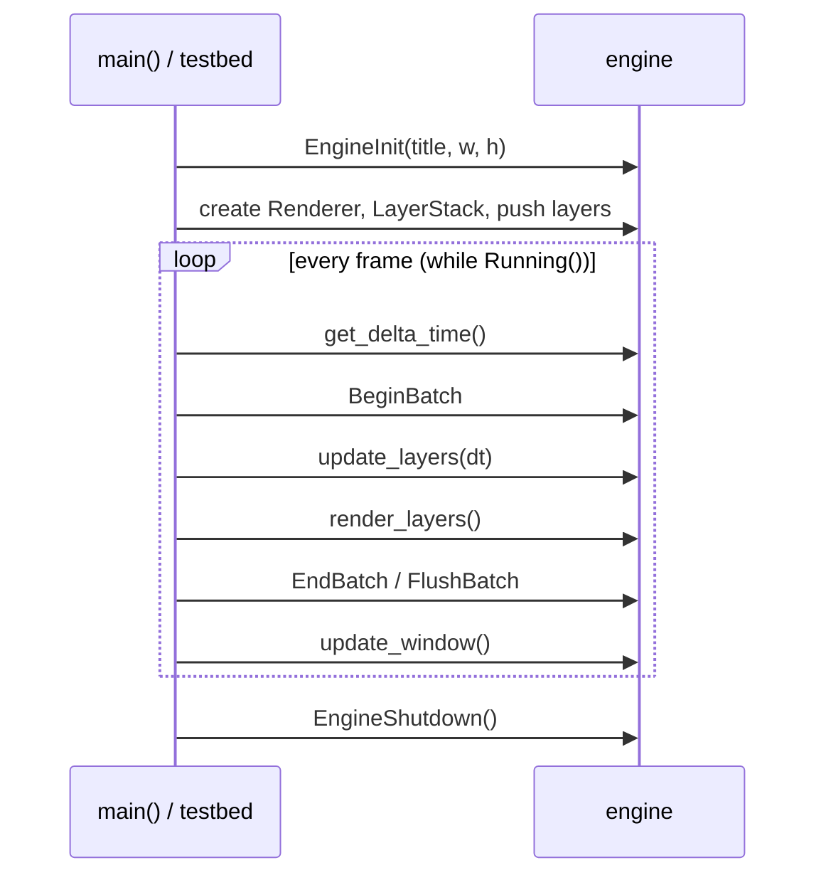
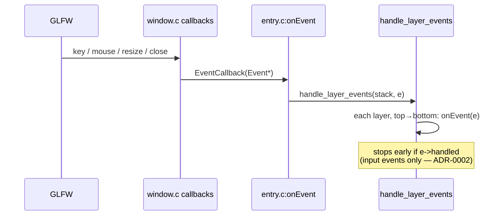

# Reynolds Engine — Architecture

> A 2D game engine written in C over OpenGL (GLEW) and GLFW. This document maps how
> the pieces fit together. For the **status** of each system see [`progress.md`](progress.md);
> for the **why** behind specific decisions see [`docs/adr/`](docs/adr/).

## 1. Big picture

Reynolds is a **2D batch-rendered** engine driven by a **layer stack** and a synchronous
**event system**. The host application (e.g. `testbed/`) owns `main()` and the game loop; the
engine provides windowing, rendering, input, camera, and utilities as a static library.

```
testbed (game)  ── uses ──>  engine (static lib)  ── uses ──>  GLFW · GLEW · OpenGL · cglm
```

## 2. Directory layout

```
engine/
  include/        Public API headers (what games include)
    engine.h        Umbrella header
    Camera/         Camera public headers
    utils/          vector.h ...
  src/
    core/         window, input, layers, timestep, logging
    renderer/     renderer, buffer, shader, texture, subTexture, camera
    events/       event types + dispatch
    platform/     platform.h (platform boundary)
    utils/        vector, hash
  vendor/         stb_image, stb_truetype, miniaudio (single-header libs)
testbed/          Minesweeper game built on the engine (the reference app)
build_files/      Windows .bat build scripts
CMakeLists.txt    Cross-platform build (incomplete — see progress.md)
```

Public headers live in `include/`; private implementation detail lives in
`src/**/*_internals.h`. Opaque types (e.g. `struct Renderer`) are forward-declared in the
public header and fully defined in a private one — so games hold a handle, not the layout.

## 3. Lifecycle

The application drives three phases (see `testbed/src/testbed.c`):

1. **Bootstrap** — `EngineInit` (window + GL context + GLEW), load shaders/textures, create
   the `Renderer`, build the `LayerStack`, push layers, configure the camera.
2. **Runtime** — the game loop: compute delta time, `BeginBatch`, `update_layers`,
   `render_layers`, `EndBatch`/`FlushBatch`, `update_window` (swap + poll).
3. **Shutdown** — unload textures, `close_window`, destroy the renderer and the layer stack
   (`EngineShutdown`).



## 4. Event flow

Input and window notifications enter through GLFW callbacks in `core/window.c`, which
translate them into engine `Event`s and pass them to the registered callback
(`entry.c:onEvent`), which dispatches through the layer stack **top → bottom**.



- Events are **synchronous and blocking** — created, dispatched, and fully handled before
  the next one (ADR-0001).
- Each `Event` is a value-type **tagged union** (`type` + a `union` payload); the
  `create*Event` factories in `events/event.c` build one per event. The old per-category
  shared objects (`mouse_event.c`, `key_event.c`, `app_event.c`) are gone — ADR-0007.
- `handled` lets an upper layer **consume** an *input* event so lower layers don't see it;
  broadcasts like resize are never consumed (ADR-0002).

## 5. The layer stack

A `LayerStack` is a `Vector` of `Layer` values. Each `Layer` holds optional function pointers
— `update(dt)`, `render()`, `onEvent(e)`, `onDetach(data)` — plus an `id`, `name`, and an
`event_enabled` flag. Order matters:

| Pass | Direction | Why |
|------|-----------|-----|
| update | bottom → top | gameplay before overlays |
| render | top → bottom (as implemented) | — |
| events | top → bottom | overlays/UI get first refusal |

Layers are stored **by value**, so per-instance state can't live in the struct; the testbed
keeps it in module-static pointers (`gameplay_layer.c`, `ui_layer.c`) — ADR-0003.

## 6. The renderer

A 2D **batch renderer** (`renderer/`):

- One large dynamic vertex buffer; quads are written into a CPU buffer (`DrawQuad` /
  `DrawColour`) between `BeginBatch` and `EndBatch`, then uploaded and drawn in a single
  `FlushBatch`.
- Up to `MAX_TEXTURE_SLOTS` textures per batch; a 1×1 white texture in slot 0 lets coloured
  (untextured) quads share the same shader.
- A new batch starts automatically when the index or texture-slot budget is hit.
- Uniform locations are cached (`shader.c:GetUniformLocation`).
- The vertex layout is described declaratively (`buffer.c`, `PUSH_ELEMENT`) and translated to
  `glVertexAttribPointer` calls.

## 7. Platform boundary (and the GLFW-weaning plan)

GLFW is **not** spread across the engine — real `glfw*` calls live in only four files:
`core/window.c` (window/context/callbacks), `core/input.c` (polling), `core/timestep.c`
(`glfwGetTime`), and `engine.c` (version banner). The event system contains **no GLFW**.

The remaining leak is **GLFW key codes** (`GLFW_KEY_*`) used above the platform layer
(`OrthoCameraController.c`, testbed input). Plan (ADR-0004): define engine-owned key/button
enums, translate GLFW→engine codes in `window.c`, and have `Event` carry engine codes — so
nothing above the boundary names GLFW.

## 8. Data ownership

| Thing | Created by | Freed by | Notes |
|---|---|---|---|
| `Window` | `create_window` | `close_window` | single global |
| `Renderer` | `renderer_create` | `renderer_destroy` | opaque handle; owns GPU buffers, white texture, shader path |
| `LayerStack` | `InitLayerStack` | `destroy_layer_stack` (via `EngineShutdown`) | owns the `Vector`; pops call each layer's onDetach` |
| Textures | `LoadTexture` | `freeTextures` / testbed unload | tracked in an asset-manager `Vector` |
| `PhysicsWorld` (prototype) | `physics_create` | `physics_destroy` | not in `main` yet |

## 9. Vendored dependencies

| Lib | Use | Status |
|---|---|---|
| stb_image | texture / image loading | in use |
| stb_truetype | text / font rasterisation | vendored, not yet wrapped |
| miniaudio | audio | in use |
| cJSON (testbed) | board / save JSON | testbed only |

## 10. Build

- **Windows (real path):** `build_files/build.bat` (engine → DLL + import lib) and
  `testbed/build.bat` (game → exe), via gcc/MinGW linking `glfw3`, `glew32`, `opengl32`.
- **CMake:** present but **incomplete** — only links `OpenGL::GL`, not GLFW/GLEW/cglm, so it
  does not yet build cross-platform (tracked in `progress.md`).

## 11. Where to look first (re-onboarding)

Coming back after a break? Read in this order: `testbed/src/testbed.c` (the lifecycle) →
`engine/include/engine.h` (the public surface) → `renderer/renderer.c` (the batch loop) →
`core/layers.c` + `events/` (dispatch). Then check `progress.md` and `docs/adr/`.